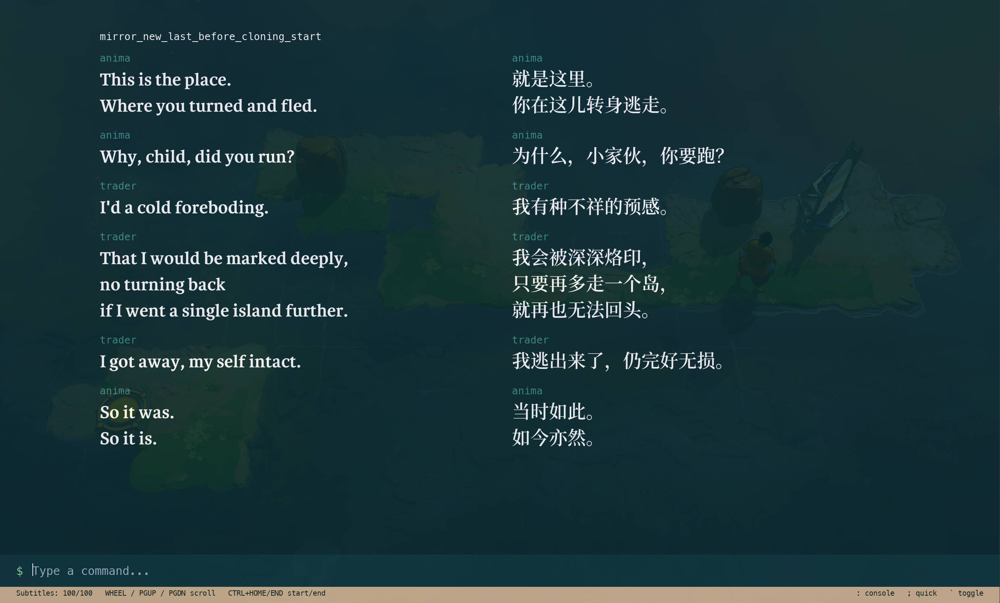
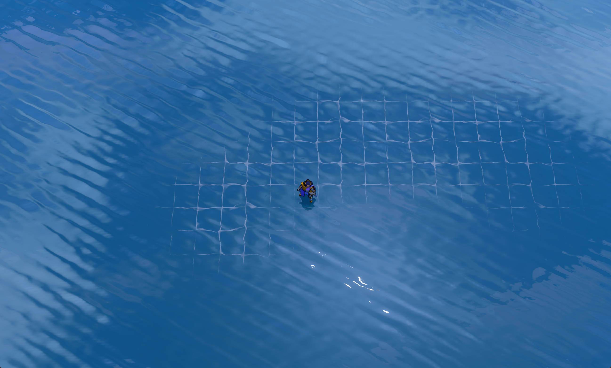
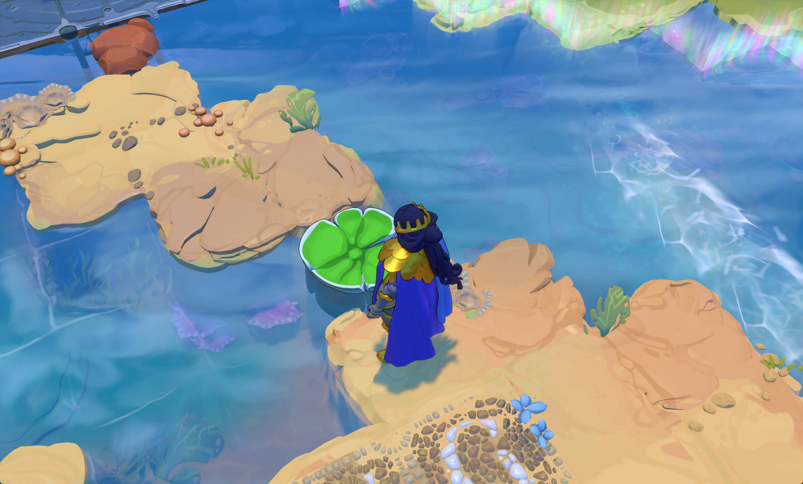
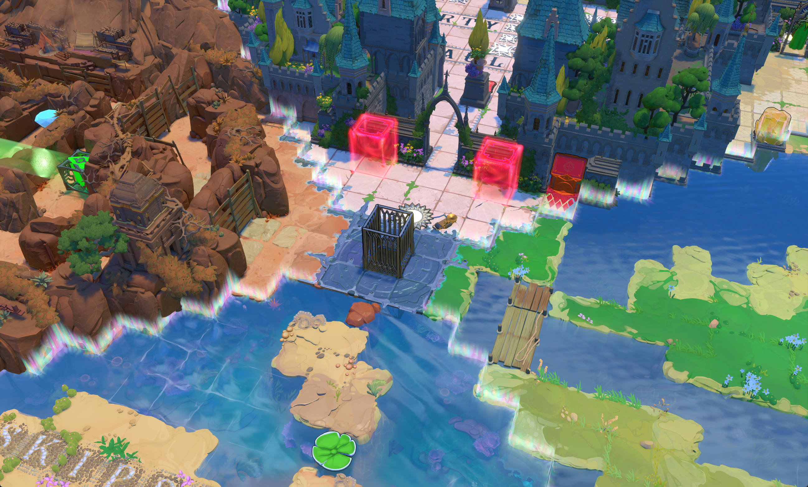
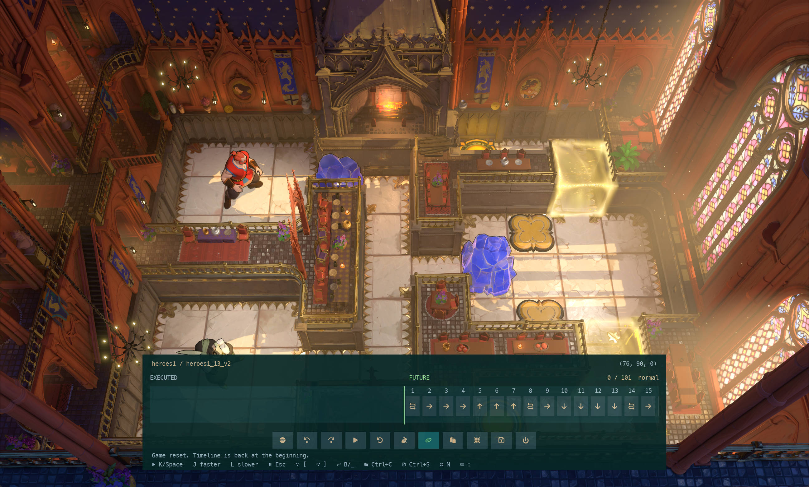
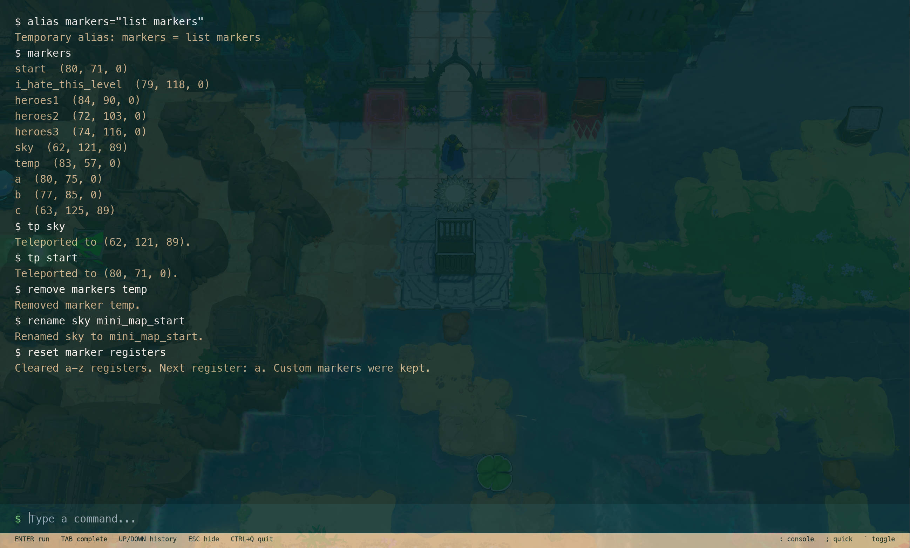

## Order of the Sinking Star Overlay Console

## Build

```bash
jai first.jai -optimized # can be shortened to -o
```

The output executable file is `bin/ootss-cmd.exe`. The configuration file is `config.rc` (you can set your game path here). Run OotSS before launching this application if you haven't set game_path in `config.rc`.

## Features

### Subtitles



### Noclip



### Freecam





### Solution Player / Editor



### Alias & Keymap

```bash
# Use alias name=command in the console for a temporary override.
# unalias name removes that override and restores this file's definition.

tp = back;

fastplay = "play -superfast";
fastdo = "play -superfast";
subtitles = "show subtitles"
level_name = "show level"

# Custom Keymaps
map m = "move -z 1";
map , = noclip;
map o = "show subtitles";
```

### Position markers and Teleport



## Others

For more, see [console.jai](./src/ui/console.jai) `CONSOLE_COMMANDS` , or use `help` command.

Here is a [Document](docs/document.md). But AI-Generated, So don't read it.
